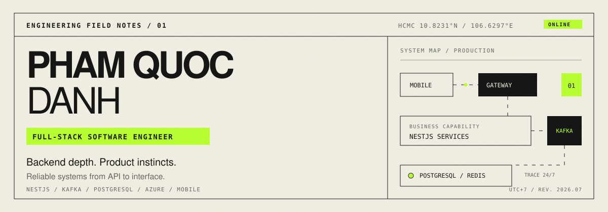
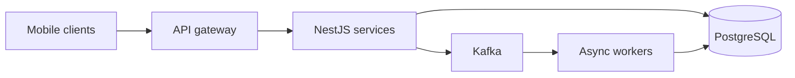

# Pham Quoc Danh

`FIELD NOTE 01 / PROFILE`

Full-stack software engineer in Ho Chi Minh City, building software that stays useful under pressure. I currently work on healthcare systems at **SynergenX**, across NestJS services, Kafka, PostgreSQL, and Azure.

My roots in offline-first mobile engineering shape how I build backends: expect imperfect networks, make failure visible, and protect the real user journey.

> **Working principle** — Clear boundaries. Reliable delivery. Products that feel fast in real hands.

---

## 01 / Current coordinates

| Signal | Reading |
| --- | --- |
| Role | Full-stack Software Engineer · SynergenX / Healthcare |
| Focus | Microservices · event-driven workflows · observability |
| Base | Ho Chi Minh City, Vietnam · UTC+7 |
| Education | B.S. Software Engineering · UIT |
| Languages | Vietnamese · English |

---

## 02 / Selected systems

| Ref. | System | Field note | Runtime |
| :--- | --- | --- | --- |
| `A-01` | **BMovie** · [Google Play](https://play.google.com/store/apps/details?id=com.builtlab.bmovie) | Streaming, secure sessions, subscriptions, cross-device progress | NestJS · PostgreSQL · Prisma · Kotlin · Docker |
| `A-02` | **Rocket Photo** | REST/gRPC social platform, PASETO security, queues, S3/R2 storage | Go · gRPC · Kafka · Redis · SwiftUI |
| `A-03` | **Hi TOEIC** · [Google Play](https://play.google.com/store/apps/details?id=com.buitlab.hi_toeic) · [App Store](https://apps.apple.com/us/app/hi-toeic/id6747833282) | 3,000+ vocabulary records, live audio rooms, real-time sync | Spring Boot · PostgreSQL · Flutter · Supabase |

---

## 03 / Working stack

```text
BACKEND     NestJS / TypeScript / Go / Spring Boot / REST / gRPC / OpenAPI
DATA        PostgreSQL / Prisma / Redis / Kafka / transactional outbox
DELIVERY    Azure / Docker / GitHub Actions / CI/CD / OpenTelemetry
MOBILE      Kotlin / Jetpack Compose / Flutter / SwiftUI / offline-first
METHOD      Microservices / event-driven systems / Clean Architecture / testing
```



---

## 04 / Open channel

[](mailto:quocdanhmyker@gmail.com)
[](https://www.linkedin.com/in/pqdanh/)
[](https://play.google.com/store/apps/dev?id=8580484381159959889)
[](https://apps.apple.com/vn/developer/pham-quoc-danh/id1817930428)

`END OF NOTE / SIGNAL OPEN`
